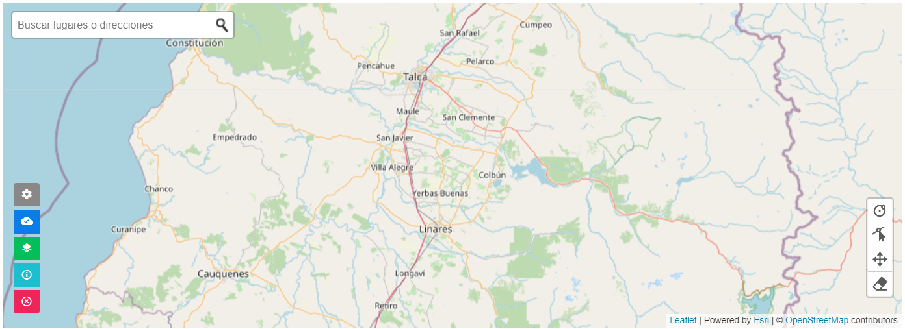
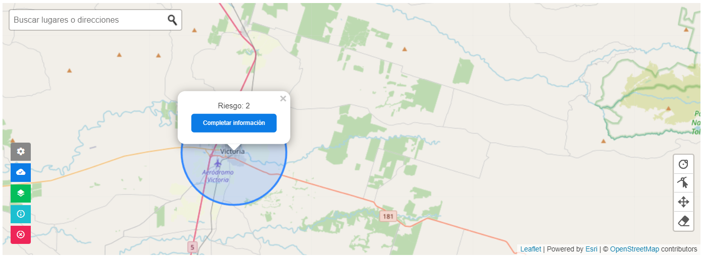
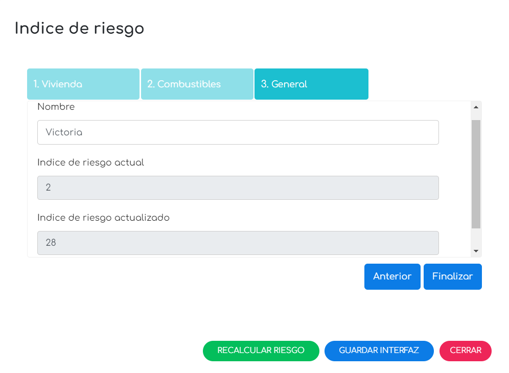

# Sistema de Inteligencia Digital para la Prevención - SIDPREV

Es un sistema en línea basado en web, que permite a encargados de
emergencia de los municipios, un análisis histórico de causas de
incendios de la comuna, usando datos oficiales de CONAF.

En base a las causas específicas en cada interfaz, el SIDPREV configura
una Agenda de Prevención Comunitaria, con medidas generales y
específicas y permite realizar un monitoreo permanente de su ejecución.

## Tecnologías

-   Codeigniter 4.1.5
-   Bootstrap 4
-   jQuery 3.2.1
-   AJAX
-   PostgreSQL 12
-   Geoserver 2.20.1
-   Leaflet 1.7.1
-   Leaflet Plugins: Leaflet Panel Layers, BetterWMS, Esri Leaflet
    Geocoder, Leaflet.Control.Custom, Leaflet-Geoman.

## Requisitos de servidor

-   PHP 7.3 o superior.
-   Extensiones **intl**, **mbstring**, **php-json**, **php-mysqlnd** y
    **php-xml**. (php.ini)
-   Controlador **Postgre** para el flujo de trabajo con PostgreSQL.
-   Opcionalmente, **psql** (versión sugerida 12.9) para gestionar
    PostgreSQL por consola.
-   Java JDK versión 11. (requerido para trabajar con Geoserver)

## Requisitos de bases de datos

Las bases de datos trabajadas en el proyecto deben tener instaladas las
siguientes extensiones:

-   **postgis**: para el trabajo con datos espaciales.
-   **unaccent**: para permitir búsquedas de texto.
-   **pgcrypto**: para encriptación de datos.

## Estructura y funcionamiento general

Para acceder al sistema se debe ingresar la [URL
base](http://sidprev.interfire.cl) del proyecto en el navegador web. El
sistema sólo funciona bajo protocolo HTTP, puesto que Geoserver requiere
de una configuración de Proxy para funcionar bajo protocolo HTTPS. Sin
la configuración anterior, no se puede acceder a las capas públicas de
Geoserver porque existirá un error de seguridad entre protocolos.

Para ingresar al sistema los usuarios finales deben completar un
registro en la página destinada para ello. Luego de esto, el usuario
deberá esperar a que personal del equipo de Interfire SpA, en calidad de
habilitador, permita el acceso. Por su parte, el habilitador debe
gestionar los usuarios a través del [panel de administración de
usuarios](https://github.com/RafaelFuentealba/panel-interfire).

El sistema se organiza en cinco módulos:

-   **Crear interfaz**. Permite la creación de interfaces que gestionará
    el usuario.
-   **Análisis**. Entrega información relacionada con el riesgo, las
    causas y síntesis de causas de la última interfaz creada por el
    usuario.
-   **Generar APC**. Permite gestionar las medidas específicas y medidas
    generales de la Agenda de Prevención Comunitaria de la última
    interfaz creada por el usuario.
-   **Gestionar interfaces**. Permite gestionar la información de todas
    las interfaces creadas por el usuario.
-   **Reportes**. Entrega información relacionada con el riesgo, causas,
    y síntesis de APC a nivel comunal y a nivel de interfaces.

### Crear una interfaz

Para crear una interfaz se utiliza la barra de herramientas de creación
proporcionada por el plugin Leaflet-Geoman. Inicialmente la barra de
herramientas se encuentra oculta, por lo que se deberá activar
utilizando el botón gris de la barra de herramientas principal que está
ubicada en la parte inferior izquierda del mapa en el módulo **Crear
interfaz**.

Funciones de los botones de plugin Leaflet-Geoman:

-   El primer botón habilita la figura de tipo circunferencia. Dado que
    esta figura sólo posee un centro y un radio, el usuario debe definir
    el centro de la figura con un click en el mapa y mover el curso
    arbitrariamente para definir el radio. Terminada la definición del
    radio, debe dar otro click en el mapa para finalizar la creación de
    la figura.
-   El segundo botón habilita la capacidad de redefinir el radio de la
    figura de tipo circunferencia.
-   El tercer botón habilita la capacidad de desplazar por completo una
    figura en el mapa.
-   El cuarto botón habilita la capacidad de borrar una figura definida
    en el mapa.

### Conseguir el riesgo de la interfaz

Para obtener el riesgo de una interfaz es necesario que el usuario
defina una figura en el mapa. Teniendo lo anterior, el usuario puede
hacer click en el botón de color azul de la barra de herramientas
principal (ubicada en la parte inferior izquierda del mapa) para iniciar
el proceso de recopilación de los datos. Al término, el sistema mostrará
el riesgo (en escala de 0 - 100) junto con la opción para acceder al
formulario donde se completa la información relacionada con la interfaz.

### Completar información y guardar interfaz

El usuario debe responder algunas preguntas relacionadas con la
percepción de limpieza del techo de todas las viviendas que están dentro
de la interfaz, así como también declarar la existencia de residuos
agrícolas, forestales, domésticos e industriales. Además, debe indicar
un nombre para la interfaz de manera que se puede diferenciar de las
demás interfaces que haya creado o aquellas que cree posteriormente. En
esta pantalla el usuario puede hacer click en el botón “RECALCULAR
RIESGO” para obtener el riesgo final de la interfaz; que no es más que
el valor de riesgo previo y la ponderación de las respuestas
proporcionadas. Por último, el usuario puede hacer click en el botón
“GUARDAR INTERFAZ” para registrar los datos correspondientes en el
sistema y comenzar a gestionar la interfaz.

### Gestión de la información

-   **Análisis**

    -   **Riesgo**: proporciona el detalle de todas las componentes del
        índice de riesgo de la última interfaz creada.
    -   **Causas**: proporciona información de las causas de los
        incendios que existen dentro de la última interfaz creada; según
        los grupos de causas que reporta CONAF.
    -   **Síntesis de causas**: proporciona información relevante de las
        causas de los incendios que existen dentro de la última interfaz
        creada, organizadas por grupo y frencuencia.

-   **Generar APC**

    -   **Medidas específicas**: permite gestionar las medidas
        específicas que sugiere el sistema para cada grupo según las
        causas específicas encontradas en la última interfaz creada.
    -   **Medidas generales**: permite gestionar las medidas generales
        que sugiere el sistema para la última interfaz creada.

-   **Gestionar interfaces**:

    -   permite gestionar la información de todas las interfaces creadas
        por el usuario.

-   **Reportes**

    -   **Comunales**: proporciona el detalle de las componentes del
        índice de riesgo, las causas y síntesis de las agendas de
        prevención dentro de la comuna que define el usuario.
    -   **Interfaces**: proporciona el detalle de las componentes del
        índice de riesgo, las causas y síntesis de las agendas de
        prevención considerando la información de todas las interfaces
        definidas por el usuario.

## Versión 1.0.0

Corresponde a la primera versión lanzada del proyecto. El sistema
permite:

-   Visualizar las diferentes capas geográficas cargadas en Geoserver.
-   Crear una interfaz de tipo circunferencia a partir de un centro y
    radio arbitrario que es definido por el usuario.
-   Mostrar información relacionada con el riesgo de la interfaz,
    definiendo todos los elementos que componen amenaza y
    vulnerabilidad.
-   Mostrar información relacionada con las causas encontradas dentro de
    la interfaz.
-   Exportar la información relacionada con las causas a un archivo PDF.
-   Generar una Agenda de Prevención Comunitaria (APC) basado en las
    causas específicas encontradas dentro de la interfaz. Esta agenda
    comprende medidas específicas y medidas generales.
-   Mostrar y gestionar las medidas específicas de la APC que son parte
    de los diferentes grupos de causas específicas. Cada medida
    específica proporciona a sus respectivos responsables.
-   Mostrar y gestionar las medidas generales de la APC para la
    interfaz. Cada medida general proporciona a sus respectivos
    responsables.
-   Exportar la Agenda de Prevención Comuntaria a un archivo PDF.
-   Gestionar toda la información de las interfaces definidas por el
    usuario.
-   Definir la comuna donde se generan los reportes comunales.
-   Generar un reporte comunal. Esto incluye el riesgo de la comuna y
    todos sus elementos, la síntesis de causas y síntesis de las Agendas
    de Prevención Comunitarias involucradas en la comuna.
-   Generar un reporte a lo largo de todas las interfaces definidas por
    el usuario. Esto incluye el riesgo, la síntesis de causas y síntesis
    de las Agendas de Prevención Comunitarias involucradas en las
    interfaces.
-   Editar la información de la cuenta de usuario.
-   Recuperar contraseña de la cuenta de usuario mediante correo
    electrónico.
-   Acceder de forma ilimitada y en línea a través del navegador web.

## Características futuras a considerar

Entre las características a considerar para las siguientes versiones se
tiene:

-   Configurar Geoserver para trabajar bajo protocolo HTTPS.
-   Implementar la creación de interfaces uniformes utilizando el
    elemento *Polygon* del Plugin Leaflet-Geoman.
-   Elaborar e implementar una Agenda de Prevención Comunitaria base
    para aquellas interfaces que no tengan incendios históricos.
